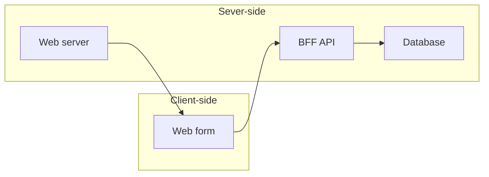

# Lab - Web Form Database

Lab covering integrating a web form input to a database via a Backend-For-Frontend (BFF) API.

## Objectives

In this lab, you will:

- Create a web form that allows a user to input data
- Use a BFF API that accepts the form data and stores it in a database
- Create a database to store the form data

## Overview

A typical system for this kind of application would have three or four different components working together to create one application:

- Client-side: A frontend web form that allows a user to input data
- Server-side: A web server that serves the frontend web form
- Server-side: A backend-for-frontend (BFF) API that accepts the form data, processes it and stores it in a database
- Server-side: A database to store the form data



For this lab, the BFF and web server have been combined into the same app for simplicity and lab delivery.

### BFF API / Web Server

The Backend-For-Frontend (BFF) API has been provided for you. It is a simple flask (python) application that accepts a POST request and stores the data in a database.

It makes use of the following two python libraries:

- [Flask](https://flask.palletsprojects.com/en/1.1.x/) - A python web framework
- [pyodbc](https://pypi.org/project/pyodbc/) - A Python Open Database Connectivity (ODBC) library

To run the BFF/Web Server, run the following command in the terminal:

```bash
flask run
```

This will start the BFF/Web Server on port 5000. If running in a Codespaces environment, you can access the BFF/Web Server by clicking on the "Open Ports" button in the bottom left of the Codespaces window and selecting "Open Browser".

## Instructions

### Create a database

1. Create a database called `WebForm` to store the form data.

1. In the `WebForm` database, create a table called `Submission`. The table should have the following columns:

    | Column Name | Data Type | Description |
    | ----------- | --------- | ----------- |
    | id | int | Unique identifier for the record |
    | name | varchar(50) | Name of the person |
    | email | varchar(50) | Email address of the person |
    | message | varchar(max) | Message from the person |

### Create a web form

1. Using `index.html` create the basic outline of a web page.

1. Add a form to the web page. The basic outline for the form is as follows:

    ```html
    <form action="/submit" method="POST">
        <!-- add inputs here -->

        <input type="submit" value="Submit">
    </form>
    ```

    When the form is submitted, it will send a POST request to the `/submit` endpoint of the BFF API.

1. The following inputs will need to be added to the form:

    - Name
    - Email
    - Message

    For the name input, add the following (between the `<form>` tags):

    ```html
    <label for="name">Name</label>
    <input type="text" name="name" placeholder="Enter a name">
    ```

    The `<input>` tag has a `name` attribute. This is the name of the input that will be sent to the BFF API. The `placeholder` attribute is the text that will be displayed in the input box.

1. Repeat the above step for the email and message inputs.


### Submit the form data to the BFF API

Test the form by entering some data and clicking the "Submit" button. The form data should be sent to the BFF API and stored in the database.

## Conclusion

In this lab, you created a web form that allows a user to input data and stores it in a database via a BFF API.

Reflect on the following questions and then discuss with a partner:

- What are the benefits of using a BFF API?
- What are the benefits of using a database?
- What security concerns are there with this application?
